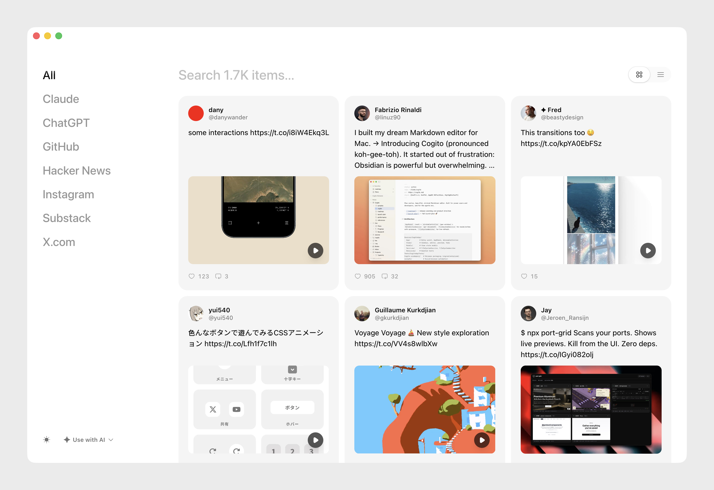
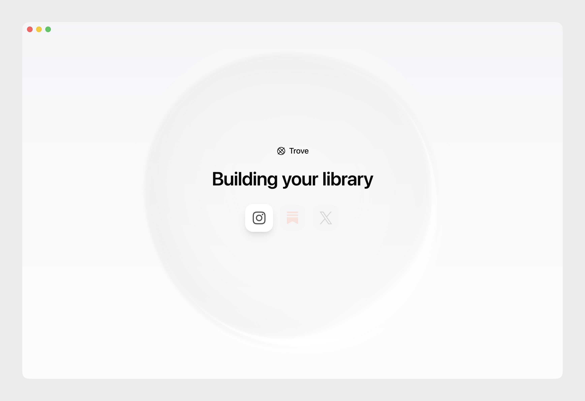

#  Trove

**Your entire internet, in one place.**

You already have a second brain. It's your X bookmarks, Instagram saves, Substack reads, GitHub stars, Claude conversations, and ChatGPT threads. The problem is it's scattered across a dozen apps, invisible to every AI tool you use.

Trove pulls all of it into one local folder. Then you point Claude Code, Codex, or any AI agent at it and ask questions across everything you've ever saved.

Everything stays on your machine. No cloud, no account, no API keys, no data leaves your disk.

<p>
  
</p>
<p>
  
</p>

## Get Started

### Desktop App

Download the [macOS desktop app](https://github.com/Lowside-Labs/Trove/releases/latest), open it, and follow the setup flow.

> The macOS desktop build is currently unsigned. On first launch, macOS will block it. Open **System Settings > Privacy & Security** and click **Open Anyway**.

### CLI

```bash
curl -fsSL https://raw.githubusercontent.com/Lowside-Labs/Trove/main/install.sh | bash
trove init
trove sync x
trove sync claude
cd ~/.trove && claude
```

Five commands from zero to asking your AI about everything you've saved. Requires Node 22+.

## Supported Sources

| Source | What syncs | Auth |
| --- | --- | --- |
| X | Bookmarks, likes | Browser cookies |
| Instagram | Saved posts | Browser cookies |
| Substack | Saved articles, likes | Browser cookies |
| GitHub | Stars | Browser cookies |
| Hacker News | Favorites, favorite comments | Public web (no login) |
| Claude | Chat exports | Active Chrome tab |
| ChatGPT | Chat exports | Active Chrome tab |

Cookie-based sync is macOS only today. Claude and ChatGPT sync require Chrome with **View > Developer > Allow JavaScript from Apple Events** enabled.

## How It Works

`trove init` creates a workspace with a SQLite database and agent guide files. `trove sync <source>` imports your saved content. Open the workspace folder in Claude Code, Codex, or Obsidian.

```text
~/Trove/
  CLAUDE.md        # Claude Code reads this on launch
  AGENTS.md        # Codex and other agent tools read this
  INDEX.md         # snapshot of your collection
  content/         # hydrated articles and exported chats
  data/trove.db    # SQLite archive with FTS5 search
  raw/             # source-native payloads
```

`trove hydrate` fetches linked articles and writes them as markdown. `trove search` queries the archive from the CLI.

## Commands

| Command | What it does |
| --- | --- |
| `trove init` | Create a workspace and initialize the database |
| `trove sync <source>` | Import content from a source |
| `trove hydrate` | Fetch readable content for external links |
| `trove search <query>` | Search indexed items with FTS5 |
| `trove stats` | Show counts and freshness by source |
| `trove index` | Regenerate `INDEX.md`, `AGENTS.md`, and `CLAUDE.md` |

## Installation

```bash
curl -fsSL https://raw.githubusercontent.com/Lowside-Labs/Trove/main/install.sh | bash
```

The installer downloads the latest release, installs under `~/.local/share/trove`, and links the `trove` binary into `~/.local/bin`. To install a specific release, set `TROVE_VERSION=v0.1.0`.

Manual install from source:

```bash
git clone https://github.com/Lowside-Labs/Trove.git
cd Trove && pnpm install && pnpm build
node packages/trove-cli/dist/cli.js --help
```

## Limitations

- Cookie-based sync is macOS only
- `chrome` and `dia` are verified for cookie-backed sync; `brave` and `arc` are experimental
- Some sources don't expose true saved/liked timestamps, so Trove stores the closest available
- Hydration targets external article links, not every native page type

## Troubleshooting

- **No cookies found**: confirm you're logged into the service in the selected browser profile
- **Cookie sync fails on Linux/Windows**: expected, cookie reuse is macOS only today
- **`better-sqlite3` mismatch in tests**: verify you're using Node 22
- **Claude/ChatGPT sync**: requires an open Chrome tab with JavaScript from Apple Events enabled. Use `--cdp-url <url>` to attach manually if needed.

## Development

```bash
pnpm install
pnpm lint
pnpm format:check
pnpm typecheck
pnpm test
```

Local CLI development:

```bash
pnpm dev:local -- sync substack    # uses .tmp/local-dev/workspace
pnpm dev:local -- where            # show isolated paths
pnpm dev:local -- reset            # reset local dev workspace
```

Desktop development:

```bash
pnpm --filter trove-desktop dev              # launch against local workspace
pnpm --filter trove-desktop dev:onboarding   # force onboarding flow
pnpm --filter trove-desktop dev:reset        # reset isolated desktop workspace
```

## Releasing

```bash
pnpm release patch
pnpm release minor
pnpm release major
```

For the first tagged release, use an exact version: `pnpm release 0.1.0`. See `RELEASING.md` for the full checklist.
