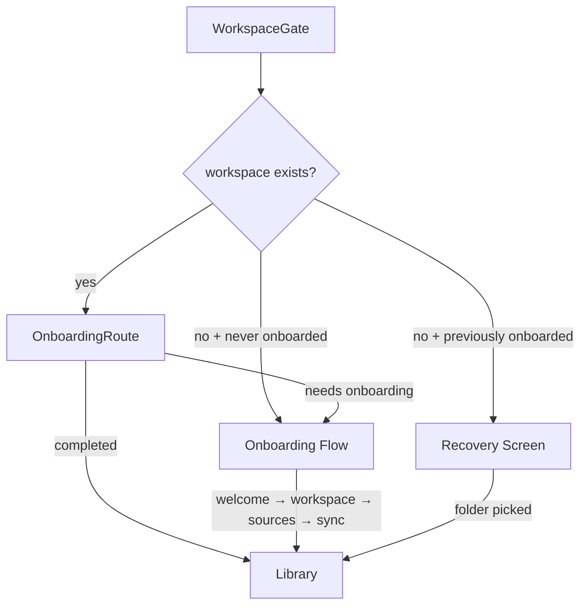

## BLUF
Merge the workspace setup screen into the onboarding flow as a step, creating one state machine for the entire first-run experience. The key design decision is a two-phase provider: workspace steps run before the snapshot exists, source/sync steps run after. The workspace step also doubles as a recovery screen when a returning user's folder is missing.

## Shape

## Modules
- **M1: WorkspaceGate**
  owns: launch-state triage (first-run vs ready vs recovery) · interface: snapshot + onboarding-completed flag in, route decision out · depends: none · must not depend: M3

- **M2: OnboardingFlow**
  owns: step sequencing for welcome → workspace → sources → sync · interface: step ID + actions in/out · depends: M3 (after workspace step completes) · must not depend: M1

- **M3: OnboardingProvider**
  owns: onboarding state (current step, selections, HN username) · interface: context value out · depends: none · must not depend: M1, M4

- **M4: WorkspaceStep**
  owns: folder picker UI, calls setRoot IPC · interface: snapshot.setup in, onWorkspaceReady callback out · depends: none · must not depend: M3 (no useOnboarding — receives actions via props)

- **M5: RecoveryScreen**
  owns: standalone folder picker for returning users · interface: same as M4 but no welcome, no onboarding context · depends: none · must not depend: M2, M3

## State
- S1: `onboardingStep` · kind: client · owner: M3 · truth: useState in OnboardingProvider
- S2: `workspaceSnapshot` · kind: client/derived · owner: M1 · truth: IPC getSnapshot result
- S3: `onboardingCompleted` · kind: persistent · owner: M1 · truth: localStorage flag
- S4: `workspaceSetup` · kind: derived · owner: M1 · truth: snapshot.setup from main process (suggestedRoot, defaultRoot)

## Flows
- **F1: First-ever launch**
  path: M1 detects missing workspace + S3 is false → mounts M2 → welcome step → M4 workspace step calls setRoot IPC → M1 refreshes snapshot → M3 receives ready snapshot → sources → sync → marks S3 complete · writes: S1, S2, S3 · fails: setRoot IPC fails → error inline in M4, user retries

- **F2: Returning user, workspace gone**
  path: M1 detects missing workspace + S3 is true → mounts M5 → user picks folder → setRoot IPC → M1 refreshes snapshot → library · writes: S2 · fails: same as F1

- **F3: Normal launch**
  path: M1 detects ready workspace → checks S3 + totalItems → library or M2 at sources step · writes: none · fails: snapshot IPC fails → error screen

## Invariants
- I1: OnboardingProvider never receives source/sync steps without a ready snapshot.
- I2: The workspace step must work identically whether rendered inside M2 or as M5 standalone.
- I3: A user who completed onboarding never sees the welcome step again (only recovery).
- I4: `workspace-setup-screen.tsx` is deleted — no parallel implementation.

## Patterns
- PT1: **Two-phase provider** in M3 — snapshot is optional at mount, required before advancing past workspace step. Prevents the need for a separate pre-onboarding state machine.
- PT2: **Shared step component** for M4/M5 — same UI component receives callbacks via props, not context. Usable both inside and outside the onboarding provider.

## Risks
- R1: OnboardingProvider currently requires `snapshot: ReadyWorkspaceSnapshot` as a required prop. Changing to optional requires null-checks in sources/sync steps. · mitigation: Only the welcome and workspace steps run before snapshot exists. Guard sources/sync with an invariant check — throw if snapshot is null at those steps.
- R2: `skipWelcomeOnce` hack in WorkspaceGate routes around the duplicate welcome. Removing it changes the post-workspace-creation entry point. · mitigation: After workspace step completes inside onboarding, the flow naturally advances to sources. No skip needed.

## Decisions
- D1: "In context of unifying the onboarding flow, facing the provider needing a ready snapshot, chose to make snapshot optional in the provider and gate source/sync steps over splitting into two providers, to keep one state machine, accepting null-checks at the step boundary."
- D2: "In context of workspace recovery, facing whether to re-run full onboarding, chose a standalone recovery screen over re-onboarding to avoid re-asking questions the user already answered, accepting a second mount point for the workspace picker component."

## Open Questions
- Q1: Should recovery screen offer "Start over" (full re-onboarding)? · status: deferred — not needed for v1, easy to add later as a button that clears S3.
- Q2: Should the workspace step show a back button to return to welcome? · status: accepted — yes, standard navigation within the flow.

## Rollout
- Phase 1: Add workspace step to onboarding, make provider snapshot optional, delete workspace-setup-screen.tsx, update WorkspaceGate triage logic.
- Phase 2: Add recovery screen for returning users with missing workspace (can ship same PR if small enough).

## Gate
| Check | Status | Note |
|-------|--------|------|
| State ownership clear | pass | S1-S4 have single owners |
| Module boundaries clean | pass | M4 is props-driven, no context dependency |
| Failure handling defined | pass | IPC failures inline in M4/M5 |
| Async complexity justified | pass | No new async — same IPC calls, different mount point |
| Migration risk assessed | pass | localStorage flag unchanged, config.json unchanged |
| No premature abstraction | pass | M4/M5 share a component, not an abstraction layer |

## Next
Expand: M3 (provider changes), F1 (full first-run flow detail), M4 (workspace step component interface)
